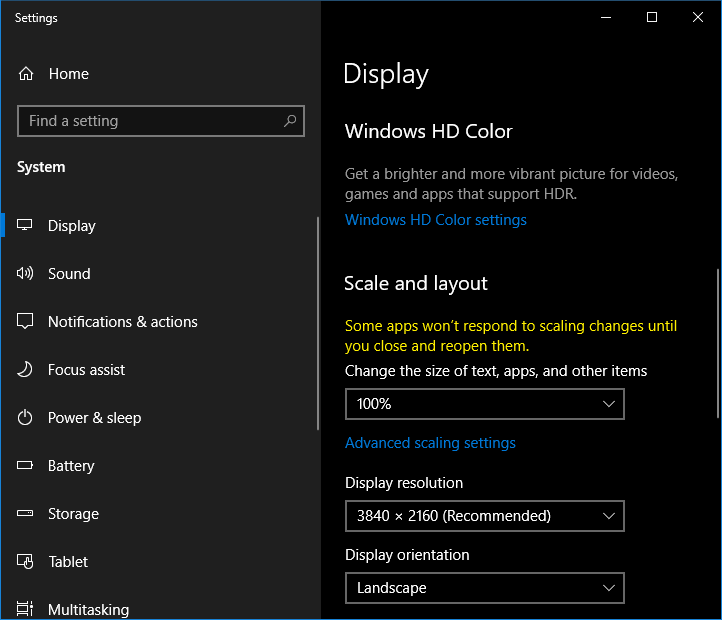

# Puppeteer Capture Local Files

## Setup
Node 12+: uses ESM modules

```js
// .profile.secret.js
// User & OS specific settings

//ASSUME Windows
export let ENV = {
	user:`USERNAME-FOLDER`
}

export let BROWSERS = {
	//windows
	canary:`C:\\Users\\${ENV.user}\\AppData\\Local\\Google\\Chrome SxS\\Application\\chrome.exe`,
	edge:`"C:\\Program Files (x86)\\Microsoft\\Edge\\Application\\msedge.exe"`,
	fxdev:`C:\\Program Files\\Firefox Developer Edition\\firefox.exe`,
}

```

### Video Monitor **Warnings**

Your video display *must not scale*.  (At least in Windows)
If your display scales, your images will be the wrong size and your automated tests will give wrong results &/or fail.



Also, your video color profile may alter the browsers' renderings.  EG 1 of my  2 computers rendered the images sith slightly different images for the *exact same lossless files*.  So test with 2+ computers with lossless images first.

### Firefox
Fx may timeout; can't seem to set 'image.avif.enabled' to true in headless mode.
https://developer.mozilla.org/en-US/docs/Web/WebDriver/Capabilities/firefoxOptions

## Credits

Started with on [Sagar's Puppeteer Screenshot example code](https://dev.to/sagar/how-to-capture-screenshots-with-puppeteer-3mb2)  But could not get Firefox to capture, even though it sucessfully displayed the AVIF.
